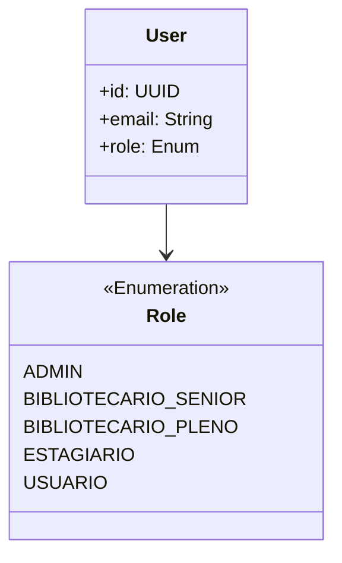

# ADR 0004: Estratégia de Autenticação e Autorização (Revisado)

## Status
**Revisado.** [2025-04-11]  
**Mudança principal:** Substituição de Keycloak por JWT local para MVP, com caminho aberto para migração futura.

---

## Contexto
### Requisitos ajustados:
- Controle de acesso baseado em roles hierárquicas ([ADR 0002](#))
- Baixa latência sem dependência externa (Identity Provider)
- Compatibilidade com evolução para SSO no futuro

---

## Decisão Revisada

### Componentes Críticos
| Componente    | Tecnologia          | Responsabilidade                               |
|---------------|---------------------|-----------------------------------------------|
| Autenticação  | JWT (Node.js)       | Geração/validação de tokens                   |
| Autorização   | RBAC com hierarquia | Controle via roles e permissions              |
| Segurança     | bcrypt + rate limiting | Proteção de credenciais e ataques brute force |

---

### Modelo de Roles (Diagrama)


---

## Padronização Técnica

### Tokens
```json
{
  "sub": "uuidv4",
  "email": "user@email.com",
  "role": "BIBLIOTECARIO_SENIOR",
  "iss": "urn:library-auth",
  "exp": 1735689600
}
```

### Fluxos
- **Autenticação:** JWT assinado com chave RSA  
- **Autorização:** Middleware de verificação de roles  

```javascript
function checkRole(requiredRole) {
  return (req, res, next) => {
    if (req.user.role !== requiredRole) return res.status(403).end();
    next();
  };
}
```

---

## Políticas de Segurança (Atualizadas)
| Cenário             | Regra                        | Ação                              |
|---------------------|------------------------------|-----------------------------------|
| Token inválido      | Assinatura/Role incorreta    | 401 + Log de tentativa           |
| Acesso não autorizado | user.role < requiredRole     | 403                               |
| Bruteforce          | >5 tentativas/min            | Block IP + Alertar admin         |

---

## Consequências

### ✅ Benefícios:
- Menor complexidade inicial
- Sem dependência de serviços externos

### ⚠️ Riscos:
- Rotação manual de chaves JWT
- Migração futura para Keycloak exigirá refatoração

### 🔄 Impactos Operacionais:
- Auditoria diária de logs de autenticação
- Backup automatizado das chaves RSA