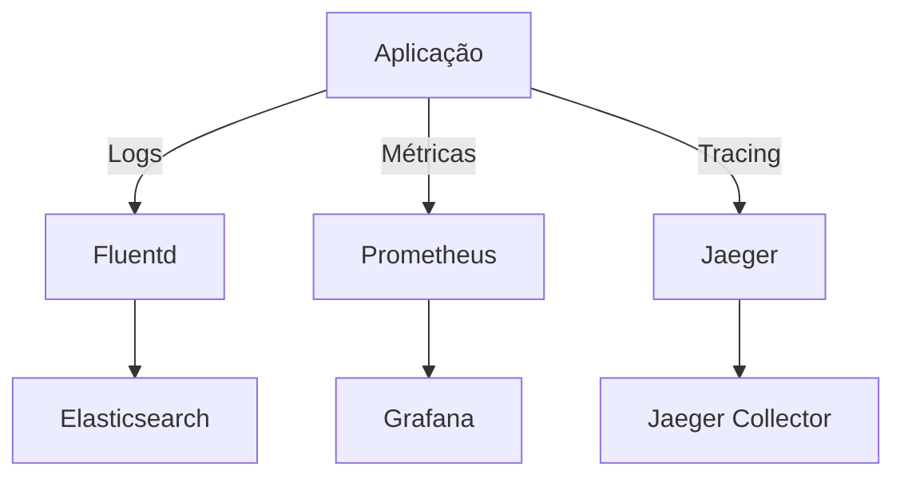

# ADR 0005: Estratégia de Observabilidade

## Status
Aprovado. [2025-04-10]

## Contexto
Requisitos derivados do ADR 0001 e necessidades operacionais:
- Visibilidade completa dos fluxos entre microsserviços
- Detecção proativa de falhas
- Análise de desempenho em produção

## Decisão

### Stack de Monitoramento

### Componentes Principais
| Tipo      | Tecnologia         | Coleta                    | Retenção       | Alertas                     |
|-----------|--------------------|---------------------------|----------------|-----------------------------|
| Logs      | ELK Stack          | Fluentd (sidecar)         | 30 dias        | Erros HTTP 5xx              |
| Métricas  | Prometheus+Grafana | OpenTelemetry SDK         | 1 ano          | Latência P99 > 500ms        |
| Tracing   | Jaeger             | W3C TraceContext          | 7 dias         | Traces incompletos          |

### Políticas Operacionais
| Cenário                         | Ação                              | Escalonamento                     |
|---------------------------------|-----------------------------------|-----------------------------------|
| Aumento de taxa de erro (>2%)   | Notificar time de desenvolvimento | PagerDuty após 15 minutos         |
| Latência acima do SLO           | Escalar pods automaticamente      | HPA + Cluster Autoscaler          |
| Armazenamento >85% capacidade   | Alertar equipe SRE               | Rotação automática de logs        |

### Consequências

#### ✅ Benefícios
- Diagnóstico 60% mais rápido
- Agilidade na identificação e correção de problemas
- Depuração em ambiente de produção
- Capacidade de analisar problemas diretamente no ambiente real

#### ⚠️ Riscos
- Sobrecarga de desempenho (~3-5%)
- Impacto no tempo de resposta das aplicações
- Custos de armazenamento
- Requer dimensionamento adequado dos sistemas de armazenamento

#### 🔄 Impactos Operacionais
- Manutenção de dashboards
  - Necessidade de atualização e organização contínua dos painéis
- Rotinas mensais de manutenção
  - Tarefas recorrentes de limpeza e otimização de dados